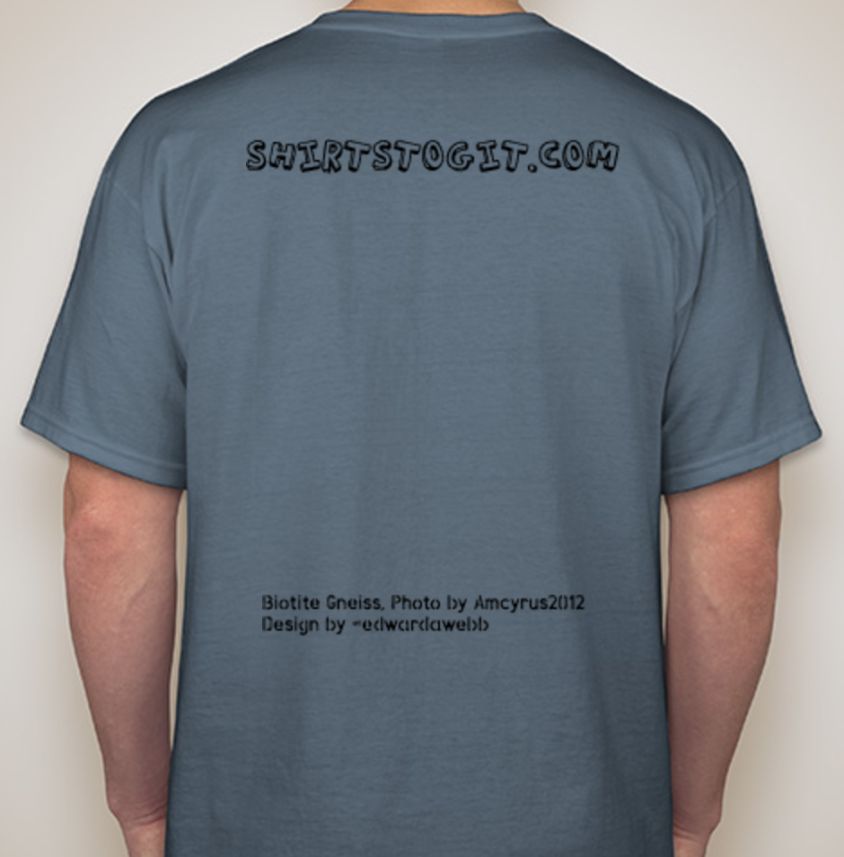

# Shirts to git
A collaborative t-shirt press with attribution!

# How's it work?
The idea is simple, people are funny, printing is expensive.  If we bulk purchase orders we get a lower pritining rate, and great t-shirts we love.

All T-Shirts designs are released under Creative Commons Attribution, meaning you could just use the image and print it yourself.  BUt you'll need to attribute the design!!  And you'll pay more to have it printed then we collectively can in bulk.

# How do I contribute?
See (contribute.md) to read requirements and process.  By contributing you claim full ownership of all rights, including any embedded or remixed work. You also accept all liability should that work turn out to be someone else's down the road (see below).

# MY design is here/has been printed and not attributed to me, or outright stolen!
Wow, that's against the law! Someone cheated and we take that seriously, please contact us immediately and we will take down the content in question and verify ownership.  If your work was stolen we can provide details of whom infringed on your rights and provide any information necessary to the powers that be.

# How do designs get published?
With the magic of Continuous Delivery!  Everytime a change is merged into `master` branch our build pipelines will automatically publish the full repository to ShirtsToGIT.com, and they will be (nearly) immediately available for you and others to start placing orders.